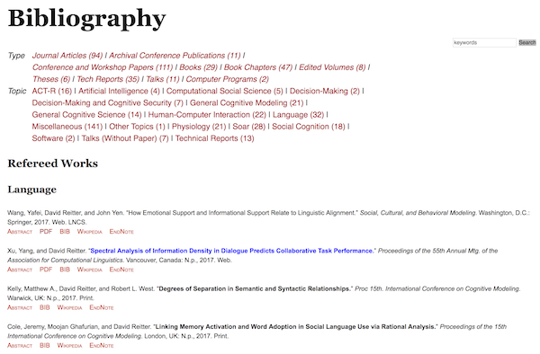

.. toctree::
   :maxdepth: 3
   :caption: Contents:

.. include:: ../README.rst

Running the zot.py program
================================
	     
.. py:module:: zot
	       
.. argparse::
   :module: zot
   :func: make_arg_parser
   :prog: Zot_Bib_Web

	  

Settings files
=======================================

The default name for a settings file is `settings.py`,
but any settings file may be loaded using the `--settings` arguments.

See `settings_example.py` for an example explanations.

.. automodule:: zot
   :members:
   :undoc-members: zot

		  
Indices and tables
=======================================

* :ref:`genindex`
* :ref:`search`
